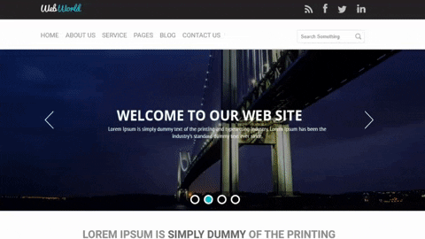

# 🌎 WebWorld

<h1 align=center>
    
</h1>

## 📃 Sobre

Projeto de Front-End feito durante o curso da Escola do Front-End utilizando HTML 5, CSS 3 e Javascript

[Demonstração](https://s4imu.github.io/webworld/)

---
## 💻 Tecnologias Utilizadas

* [HTML 5](https://www.w3schools.com/html/)         
* [CSS 3](https://www.w3.org/Style/CSS/Overview.en.html)         
* [Javascript](https://www.w3schools.com/js/js_es6.asp)
* [Slick](https://kenwheeler.github.io/slick/)

---

## 📂Como baixar o projeto

```bash
    # Clonar o projeto

    $ git clone https://github.com/s4imu/webworld.git

```